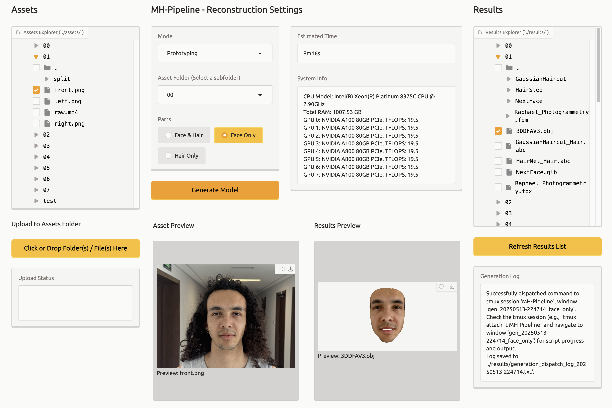

# MH_Pipeline

Pipeline for creating MetaHumans (hair & face) from images and videos.

## Overview



MH_Pipeline is a toolset for generating MetaHuman-compatible hair and face assets from images and videos. It integrates specialized components: GaussianHaircut, HairStep, NextFace, and 3DDFA—accessed through a Gradio-based GUI. Results are saved in the `results/` folder, and input assets can be placed in the `assets/` folder or uploaded directly via the GUI.

## Setup and Installation

Follow these steps to set up MH_Pipeline. Each component requires its own environment due to specific dependency needs.

### Prerequisites

- Python 3.8 or higher
- Git (for cloning repositories)
- A compatible operating system (Windows, Linux, or macOS)
- ~20 GB of disk space for dependencies and results

### Step-by-Step Installation

1. **Clone the Repository**

   Clone the MH_Pipeline repository:

   ```bash
   git clone https://github.com/your-username/MH_Pipeline.git
   cd MH_Pipeline
   ```

2. **Verify Component Folders**

   Ensure the following folders are present in the `MH_Pipeline` directory:

   - `GaussianHaircut/`
   - `HairStep/`
   - `NextFace/`
   - `3DDFA/`

   If missing, download or clone them from their respective repositories (refer to their official documentation).

3. **Configure Component Environments**

   Each component has unique dependencies. Navigate to each folder and configure its environment as instructed within:

   - **GaussianHaircut**:

     ```bash
     cd GaussianHaircut
     # Follow setup instructions in GaussianHaircut/README.md or requirements.txt
     cd ..
     ```

   - **HairStep**:

     ```bash
     cd HairStep
     # Follow setup instructions in HairStep/README.md or requirements.txt
     cd ..
     ```

   - **NextFace**:

     ```bash
     cd NextFace
     # Follow setup instructions in NextFace/README.md or requirements.txt
     cd ..
     ```

   - **3DDFA**:

     ```bash
     cd 3DDFA
     # Follow setup instructions in 3DDFA/README.md or requirements.txt
     cd ..
     ```

   Typically, this involves creating a virtual environment and installing dependencies:

   ```bash
   python -m venv env_component
   source env_component/bin/activate  # On Windows: env_component\Scripts\activate
   pip install -r requirements.txt
   deactivate
   ```

   Refer to each component’s documentation for specific instructions.

4. **Install the GUI**

   Create a virtual environment for the GUI and install the required dependencies:

   ```bash
   python -m venv env_gui
   source env_gui/bin/activate  # On Windows: env_gui\Scripts\activate
   pip install gradio pandas psutil GPUtil
   ```

   The GUI depends on the following Python packages:

   - gradio
   - os (standard library)
   - time (standard library)
   - platform (standard library)
   - psutil
   - pandas
   - math (standard library)
   - shutil (standard library)
   - re (standard library)
   - subprocess (standard library)
   - GPUtil
   - gradio_modal (included with gradio)

5. **Verify Installation**

   Confirm the setup by running the GUI (see Usage).

## Usage

**Start the GUI**

   Activate the GUI environment and launch:

   ```bash
   source env_gui/bin/activate  # On Windows: env_gui\Scripts\activate
   python gui.py
   ```

**Upload Assets**

Use the GUI to upload images or videos, or place them in the `assets/` folder.

**Get Results**

Outputs are saved in the `results/` folder.

## Contributing

Submit issues or pull requests to the repository. Ensure compatibility with existing environments.

## License

Licensed under the MIT License. See the `LICENSE` file for details.
